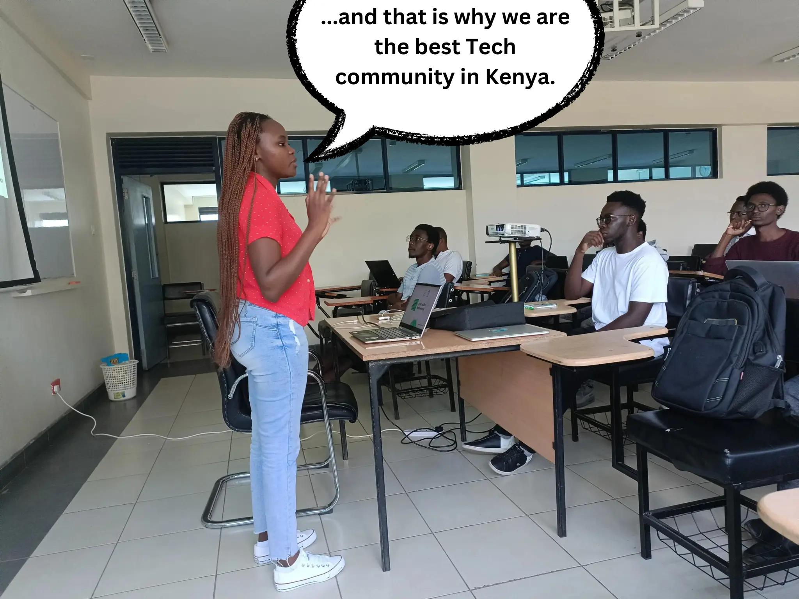

## Welcome!

Hi, Droids and Droidettes! Welcome back to yet another issue of The Kotlin Kenya Newsletter 📃. How have you all been? We hope that you had an awesome February and that you experienced the love that you deserved this month 😏. Whether you did or not, let us demonstrate our love for you by releasing this month's issue of our Newsletter. This is Newsletter #16:

## The Kotlin Monthly Challenge

During this month's meetup, our audience got to stretch their thinking by participating in [The Challenge #2](https://kotlinbits.vercel.app/quiz/2024/February) as well as flexing their Kotlin and DSA prowess. This epsisode focused on both Kotlin-specific and Algortithmic approaches to solving The Challenge and by attempting it yourself, you could see how well your code would have performed at the time. Share with us your solutions as what better way to market your skills than through flexing them at any given point in time? 🤷‍♂️

## The Code Review

Do you still feel like you could write better code? Does your GitHub repository still look like that of a Bedroom Developer? Worry not for we have permanently adopted The Code Review as part of our Monthly Meetup Curriculum. For the second time, we were joined by [The Teaman](https://twitter.com/chepsi_) who went over the following pointers (pun intended if you know C++) based on [this GitHub repository](https://github.com/lynnemunini/book-shelf):

### 1. Commenting vs Documentation
Senior Chepsi mentioned that while opinions may differ regarding its implementation and execution, documentation is important in a team-centered codebase. He stressed that documentation allows for readability of the codebase regardless of the seniority of the reader.

### 2. Write Out Why You Chose It
In addtion, he emphasised that another feature of a well-documented codebase or GitHub repository was the inclusion of the "why", that is, documenting why you chose a certain library for example. The attendees were made to understand that why they chose their tools mattered more than what tools they actually used.

### 3. Network Calls
Through a lengthy but fruitful discussion, Chepsi engaged the crowd by asking them which technologies they used for making network calls in their projects. The most outstanding takeaway was that majority of the community members preferred [Ktor](https://ktor.io/) as it supported their mission of adopting a Kotlin-first approach to building their projects.

The session and meetup in general was concluded by the attendees being asked to try and play around with their technologies and even try and build their own. A custom network-calling tool, perhaps? Food for thought.

## The Call For Speakers (Monthly Meetup)
Hey, pssst! Are you interested in becoming a speaker for the upcoming monthly meetups? For real for real? Then stop what you are doing and [click me](https://docs.google.com/forms/d/e/1FAIpQLSeGg2TFD2mBeH8AAKpWSBgYgBLLNNrZTo1BmNB5JGPHY7OTew/viewform) to make your aspiration a reality!

## Featured
|REPOSITORIES|
|:------|
|[Carizma](https://github.com/emmanuelmuturia/Carizma)|

## Until March
It is at this point that we acknowledge our new beginnings and pledge to have a transformative 2024. We have journeyed, will still journey with you and gears are about to be shifted (tech bros please calm down) in your favour. If you would like to level up your career in Android, then attending our Monthly Meetups, building in public, and interacting with our members should be part of your routine. We cannot wait to hear and share your stories. See you on March 👋...

