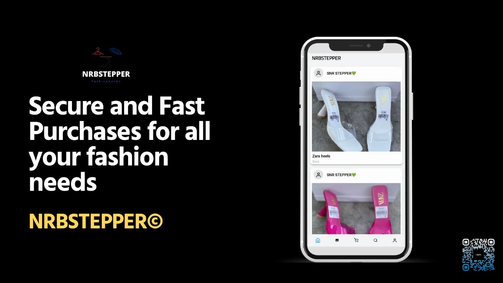

## Welcomes & Hellos!

If laughter is the best medicine then we are no doubt the best doctors 💉 in Kenya for our attendees had quite some laughs during The March Meetup courtesy of our lively speakers. Even if you did not get the chance to attend The March Meetup, worry not for this release will simulate them as we believe in leaving no man (or woman) behind. This is **Newsletter #17**:

## Keeping Your Software Fresh: How Renovate Simplifies Dependency Updates
Have you ever struggled to keep your dependencies up to date in this dynamic field of Android? Or even worse, have you ever had to deal with Ancient Dependencies? You would be forgiven after thinking that Dependabots were the only solution to this unfortunate circumstance. What if we told you that there was another way? 😮 What if we told you that it prioritises Automation? Yes, people of DevOps. This new option targets you too. Without wasting any time, [Brandy](https://www.twitter.com/arianabrandy5) introduced [Renovate](https://github.com/renovatebot/renovate) as an automated solution that seeks to ease the process of Dependency Management. In fact, we dare to say that Renovate might be better for you compared to Dependabots thanks to:

- The Dependency Dashboard that provides all of the information you need regarding your dependencies...
- The ability to upgrade common monorepo packages...
- The Multi-Platform support...
- The ability to show log changes...
- The ability to run as often as it is allowed to run...

Say goodbye to Ancient Code (Interns and Juniors we are watching you) and say hello to Automation...

## State Management in Jetpack Compose
Speaking of Ancient Code, are you still stuck writing your UI in XML and would like to migrate to Jetpack Compose? Would you like to take a step further and learn about State Management in Jetpack Compose? We had [The Beerman](https://twitter.com/noah_muhindi) take us through State Management where he implemented [The Beer App](https://github.com/Noah29m/Beer-App/tree/master) 🍺 to demonstrate the same. 

Here are a few pointers that were discussed during this session:

- State and State Management
- State Hoisting
- Definition of State in Kotlin (Jetpack Compose)

Stay tuned for a potential Part 2 of this elaborate session 😉...

## Get Started with Gemini on Android
From ChatGPT to Dall-E and now Devin, AI seems to be moving faster than most of us thought. Whether that is a good or bad thing, we cannot deny that AI is here to stay and we are all better off understanding it even at a basic level. 

Given that we do not want our developers to be rendered obsolete, we invited [The Droidette](https://twitter.com/Jacqui_Gitau) to conduct a workshop on Getting Started with Gemini on Android. She made use of [Chat Buddy](https://github.com/Jacquigee/ChatBuddy) to demonstrate the power of Machine Learning through Artificial Intelligence using [The Gemini API](https://ai.google.dev/tutorials/get_started_android) in Android. The audience was in awe for this marked a revolution of sorts in the potential of AI in building attractive, user-friendly, robust, and testable Android apps...

## The March Challenge
Are you a lover of Data Structures and Algorithms? Do you not just love a good LeetCode session where Performance and Optimization is your love language? Worry no more for whether you like it or not, we decided to feature Linked Lists in The March Challenge anyway 🤷‍♂️: 

Oh no. We did not just stop there. Android254 and Kotlin Kenya firmly believes in Test Driven Development (TDD). "yes that is great and all, but how does that relate with the March Challenge?" That is the best question you could have asked for all you need to do is [click me](https://kotlinbits.vercel.app/quiz/2024/March) and test your Testing skills. See what we did there? 😏

## DroidCon Kenya 2024
The early bird catches the worm. While we will not be catching worms any time soon, we are proud to announce that [DroidCon Kenya 2024](https://droidcon.co.ke/) will be happening from the 6th to the 8th of November this year. 

[The Teaman](https://twitter.com/chepsi_) made this announcement and gave the following pointers that we would like you to have:

- Contributions to [The Droidcon Kenya Android App](https://github.com/droidconKE/droidconKeKotlin) on GitHub are still open and if you would like to spice up your resume, get access to a simulated work environment, or even gain bragging rights in matters Open-Source, then please check out [The Issues](https://github.com/droidconKE/droidconKeKotlin/issues) listed and get to work!
- Did we mention that the event will be happening from the 6th to the 8th of November?
- DroidCon Kenya will be turning 5 so the event will be a rather special one to commemorate half a decade of fun and learning...

## Featured

### 1. Mastering Kotlin for Android 14: Build powerful Android apps from scratch using Jetpack libraries and Jetpack Compose

[His Expertness](https://twitter.com/wangerekaharun) will be launching his book: [Mastering Kotlin for Android 14: Build powerful Android apps from scratch using jetpack libraries and Jetpack Compose](https://www.amazon.com/Mastering-Kotlin-Android-14-libraries/dp/1837631719/ref=tmm_pap_swatch_0?link_from_packtlink=yes) on the 5th of April. Do you want to finally master Android(Kotlin), get that 6-figure job, and finally buy that German Machine? Well, then what are you waiting for? Pre-order the book [here](https://www.amazon.com/Mastering-Kotlin-Android-14-libraries/dp/1837631719/ref=tmm_pap_swatch_0?link_from_packtlink=yes) and get to work!

### 2. Asking Efficiently

Juniors, this one is for you. Have you ever been stuck on a coding problem and did not know who or how to ask for help? Do you ever feel like you are a bother to those you ask questions? Would you like to ask better questions using better methods (pun unintended)? If that is the case, look no further than [this article](https://evanschepsiror.medium.com/asking-efficiently-5820c41f8b29) which will guide you on how to ask efficient questions as written by a Senior...

### 3. Sain (サイン)

.gif)

Would you care to try out a tool that would allow your users to write signatures in your app? Drum rolls 🥁 please for we are excited to unveil [Sain (サイン)](https://github.com/joelkanyi/sain) to you! Sain (サイン) is a Compose Multiplatform library built by [Joel Kanyi](https://twitter.com/_joelkanyi) for capturing and exporting signatures as ImageBitmap with customizable options. Perfect for electronic signature, legal documents and more...

### 4. Palette Lab - Color Picker

If you genuinely thought that we forgot about UI/UX Design then your delusions are easily comparable to those of J*va programmers. [Palette Lab - Color Picker](https://play.google.com/store/apps/details?id=com.risma.palettelab&pli=1) is primarily built for developers, designers, and anybody with an interest in aesthetic - related activities like fashion or photography. It helps you explore color as well as see what color combinations best suit whatever your interest is, allowing you to keep a rich collection of colors and palettes. Thank [Augustine](https://twitter.com/CodesGustine?t=Mx-jvT52c7L9aA16ZhGx0Q) for this empathetic design product...

### 5. NRBSTEPPER

Are you interested in fashion and expanding your wardrobe beyond Tech swags? Would you like to purchase your next outfit based on a product built by one of our community members? Check out [NRBSTEPPER](https://www.alloysamasakha.com/etappstore) as built by [Alloys](https://twitter.com/alloysworld?t=cU2BvjIUsN6CZaiKrxP5bw) and let the dripping begin!

### 6. Jammo Sports

Footbal fans are allowed to cheer further for we are proud to introduce [Jammo Sports](https://play.google.com/store/apps/details?id=com.jammo.app.jammoapp). As its creator put it, "It is a platform to display all the sporting events majorly those happening in the African continent. It's a football platform meant for live match events converage, giving info about teams, competitions, upcoming fixtures and game results...

### 7. Navigating The Obstacles of Navigation Compose

Do you want to prevent your Android app from crashing using one simple trick in Compose Navigation? Check out [this article](https://blog.stackademic.com/this-trick-will-save-you-time-when-dealing-with-the-problems-of-navigation-compose-in-jetpack-4a63ea505c0a) that describes the pitfalls of using explicit navigation destinations and a simple solution to curb the same. The article was written by [Peter Chege](https://twitter.com/peter__me)...

## Until April
It is at this point that we acknowledge our new beginnings and pledge to have a transformative 2024. We have journeyed, will still journey with you and gears are about to be shifted (tech bros please calm down) in your favour. If you would like to level up your career in Android, then attending our Monthly Meetups, building cool stuff in public, and interacting with our members should be a part of your routine. We cannot wait to hear and share your stories. See you in April 👋...

## Credits

### 1. Newsletter Writing, Editing, and Publishing
- [Emmanuel Muturia™](https://twitter.com/emmanuelmuturia)

### 2. Speakers
- [Brandy Odhiambo](https://www.twitter.com/arianabrandy5)
- [The Beerman](https://twitter.com/noah_muhindi)
- [The Droidette](https://twitter.com/Jacqui_Gitau)

### 3. The Kotlin Challenge
- [The Chief Senior Dishwasher](https://twitter.com/mambo_bryan)

### 4. DroidCon Kenya 2024 (Announcements)
- [The Teaman](https://twitter.com/chepsi_)

### 5. Featured
- [His Expertness](https://twitter.com/wangerekaharun)
- [The Teaman](https://twitter.com/chepsi_)
- [Joel Kanyi](https://twitter.com/_joelkanyi)
- [Augustine](https://twitter.com/CodesGustine?t=Mx-jvT52c7L9aA16ZhGx0Q)
- [Alloys](https://twitter.com/alloysworld?t=cU2BvjIUsN6CZaiKrxP5bw)
- [Jammo Sports](https://play.google.com/store/apps/details?id=com.jammo.app.jammoapp)
- [Peter Chege](https://twitter.com/peter__me)

### 6. Hosts
- [Daystar University](https://www.daystar.ac.ke/)
- [Eugene Oyier](https://twitter.com/eugeneoyier)
- [Newton Mutugi](https://twitter.com/n_mutugii)

### 7. Sponsors
- [Android254](https://twitter.com/254androiddevs)
- [Kotlin Kenya](https://twitter.com/kotlinkenya)
- [KotlinBits](https://kotlinbits.vercel.app/)