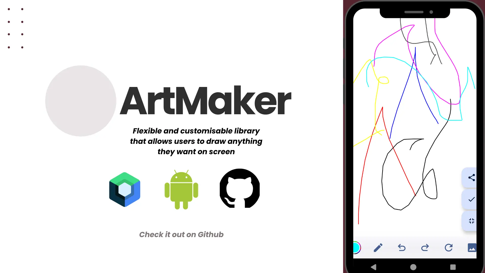

## Know Thy Meme 🤣

## Welcome & Hello! 🫂

Whoa whoa relax guys. We know that you dearly missed us and we missed you too. Winter Season may have separated us but we are here yet again to occupy your professional lives and help you achieve your goals. Do we even need to tell you how this month is different from the rest? Did you not see our poster? Well, join us in this episode as we uncover what Android254 and Kotlin Kenya have been up to this month. This is Episode #21 of The Kotlin Kenya Newsletter!

## The Kotlin Bits Challenge 🧠

To supercharge our attendees' problem-solving skills, we had them attempt [an easy LeetCode problem](https://leetcode.com/problems/remove-element/description/). If you are up for it, feel free to submit your solution to us and who knows, you just might win a prize...

## Asynchronous Programming with Coroutines 🌀

Joining us from the city of Abuja, [Michael Obi](https://www.linkedin.com/in/michaelobi/) took the stage (well, screen as it was virtual but you get the idea) and made the audience understand why Asynchronous Programming was important in the first place. Using screenshots from a language that we shall not name, he demonstrated different use cases for Threads within the context (pun intended) of expensive tasks...

## The Open Bar Session 💬

To conclude the meetup, we had an Open Bar session that was kickstarted by [Emmanuel Muturia™](https://x.com/emmanuelmuturia) who showed off [ArtMaker](https://github.com/Fbada006/ArtMaker) to the audience and encouraged them to check it out and learn more about the Canvas API in Jetpack Compose. Next, [Samuel Juma](https://x.com/_jumasamuel) demonstrated [SuperStocks](github.com/SuperStocks) which was designed to work on Kotlin Multiplatform (KMP), and is of course the new kid in the block of Android App Development (AAD). Lastly, the attendees were educated on Paystack as a FinTech product and did you know that they were recently acquired by Stripe?

## DroidCon Kenya 2024 🎟️

.webp)
.webp)

Have you still not bought your tickets to the most exciting annual event in the history of Android in Kenya? 🤦‍♂️ If we said that we had more goodies (and that is a big "If") for the first few buyers then would that motivate you to head over to [droidcon.co.ke](https://tickets.droidcon.co.ke/) and get your tickets? There you go then, you sneaky developers. 😏 Head over to [droidcon.co.ke](https://tickets.droidcon.co.ke/) and grab your tickets as you never know what awaits you from the 6th to the 8th of November this year... 🙃

## The Newset GDE in Town 🕺

.webp)

If you have been around for a while, then you will understand that certain things were just a matter of time. What we are about to announce is certainly at the top of the list. Without wasting any time, join us in congratulating [The Chief Senior Dishwasher](https://x.com/mambo_bryan) in being officially recognised by Google as a Google Developer Expert (GDE) for Android! Thus, to mark the initiation complete, we officially declare him as [The Chief Senior Dishwasher, GDE](https://x.com/mambo_bryan)...

## What Have Our Community Members Been Up To? 🤷‍♂️

### 1. ArtMaker 🎨

Are you interested in learning more about the Canvas API and Custom Drawing in Jetpack Compose? Would you like to unlock the Picasso (not the library) in you programmatically? Look no further as we would like to present to you [ArtMaker](https://github.com/Fbada006/ArtMaker) by [Ferdinand Bada](https://x.com/Ferdinand_Bada), [Caleb Langat](https://x.com/_CalebLangat), and [Emmanuel Muturia™](https://x.com/emmanuelmuturia). ArtMaker is a flexible and customisable library that allows users to draw anything they want on screen and has been built fully with Jetpack Compose. It allows drawing through the Canvas, sharing the drawn Bitmap, or programmatically exposing the Bitmap for use in the calling application...

## Until September 🫂

It is at this point that we acknowledge our new beginnings and pledge 🤚 to have a transformative 2024. We have journeyed, are journeying, and will still journey with you. Gears are about to be shifted (Tech Bros please calm down) in your favour. If you would like to level up your career in Android, then attending the monthly meetups, building cool stuff in public, and interacting with community members should be a part of your routine. 💯 We cannot wait to hear and share your stories. See you in September! 👋

## Credits 🎬

### 1. Newsletter Writing, Editing, and Publishing
- [Emmanuel Muturia™](https://x.com/emmanuelmuturia)

### 2. Speakers
- [Michael Obi](https://www.linkedin.com/in/michaelobi/)

### 3. The KotlinBits Challenge
- [Annie Kobia](https://x.com/AnnieKobia)

### 4. Announcements
- [The Droidette](https://x.com/Jacqui_Gitau)

### 5. Featured
- [Ferdinand Bada](https://x.com/Ferdinand_Bada)
- [Caleb Langat](https://x.com/_CalebLangat)
- [Emmanuel Muturia™](https://x.com/emmanuelmuturia)
- [Samuel Juma](https://x.com/_jumasamuel)

### 6. Host
- [Paystack](https://x.com/paystack)

### 7. Sponsors
- [Android254](https://x.com/254androiddevs)
- [Kotlin Kenya](https://x.com/kotlinkenya)
- [KotlinBits](https://kotlinbits.vercel.app/)