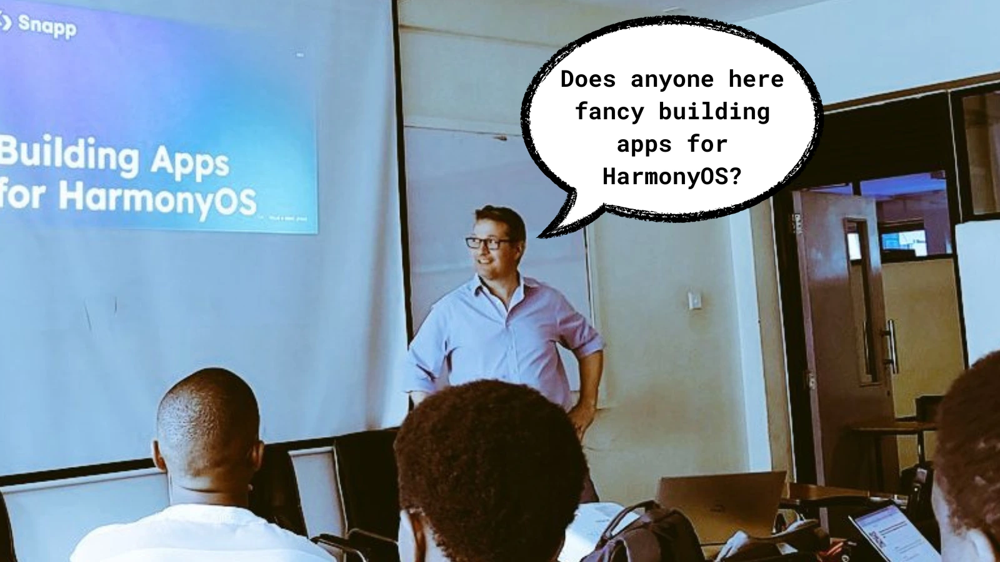

## Know Your Meme 🤣

## Welcome & Hello! 🫂

Can you hear that? 👂 The sound of a new beginning? We hope you can for we certainly are glad to be back. Happy New Year 2025, Android Engineers. 👋 How are you? Are you ready to kickstart yet another year filled with nothing but the code? Worry not, for this newsletter summarises all that the first meetup of this year sought to promise the attendees. Spoiler alert: They were promised the good stuff...

This is Episode #23 of The Kotlin Kenya Monthly Newsletter... ✍️

## The Panel Discussion 👥

Moderated by [Emmanuel Muturia™](https://x.com/emmanuelmuturia), we had a Panel Discussion talking about Job Hunting and Open Source in 2025. We are fully aware of the difficulties of Job Hunting this season and because of that, we sought to discuss the strategies that our attendees could take advantage of to get hired and drive those German Machines to our future meetups. 🚗 Jokes aside, we were joined by [Ben Salcie](https://x.com/ibensalcie) and [Kenneth Murerwa](https://x.com/KKMurerwa) who shared their insights on topics such as Upskilling, Interview Preparation, and even Career Progression as a Junior Android Engineer... 

## The Feedback Session 💬

We value our community members. 😉 We value them so much, that we held the usual Feedback Session where they got to tell us what worked and did not work last year and most importantly, what they wanted to see this year.

Do you have any feedback, suggestions, complaints, or anything nice to tell us? Waste no time and [click me](https://forms.gle/6fHnHFVi9AAuA8LU8)... 👍

## HarmonyOS 📱

If you thought that Android and iOS were the only operating systems for Mobile, then how wrong you are. 😱 You would be forgiven, though, for we were introduced to HarmonyOS, an operating system made in China not just for Mobile but for pretty much any device. All the way from Europe, [Jasper Morgan](https://x.com/jasperamorgan), the CEO of Snapp Mobile, gave a thorough talk on HarmonyOS and how to build apps for it. 💻 It is safe to say that despite the meetup being Kotlin-first the attendees were at the very least curious about this new innovation and wondered how they could get involved... 🤔

## Announcement 📣

Are you a Product & Engineering professional? ⚙️

Have over 1️⃣0️⃣ years of experience? 

Looking for an opportunity to give back? 🤗

[Partnerships for Good](https://www.linkedin.com/company/pfgafrica/) is in on a mission to enable motivated youth to thrive as Africa’s next leaders...

Get matched with a student who is keen to learn more about your profession for 1-on-1 mentoring sessions...

The students are in their last semesters of their diploma/certificate in ICT or Computing at either:

- Technical Vocation Education and Training institution or
- Community Based Organisation

Your commitment as an advisor in the 4-week program will be facilitating 1 hour sessions per week as well as some take home assignments...

[Apply Now](https://docs.google.com/forms/d/e/1FAIpQLSc1XE654yBm8J9aYJW-ZtsOF0dh5u4zbZq6hGHYV-Tt18iHFQ/viewform)

We’re accepting applications on a rolling basis. Visit our [LinkedIn page](https://www.linkedin.com/company/pfgafrica/) for more info or email us at [info@pfgafrica.org](mailto:info@pfgafrica.org)

## Feature of The Month 🙌

Would it not be great if coding was more...fun? 🤔 Well, more like a game than actual work? 😮‍💨 Sounds cool, right? Do you know what is cooler than that? The game actually exists. 😲 Let us explain:

"Over the holiday season, I had the privilege of leading a team of two amazing android engineers to turn a fun idea into reality: a GitHub-based game that makes contributing to open source both competitive and rewarding. After countless hours of brainstorming, coding, and testing, we shipped the MVP for Streeek!

🎯 Key Highlights:
- In just one day, the app garnered 30 downloads, thanks to sharing it with friends and colleagues who were equally excited about the concept.
- By establishing a clear development and release process, we were able to iterate faster, resolve blockers efficiently, and launch the MVP within a tight timeline.

🌟 Streeek is all about gamifying GitHub contributions to keep developers motivated while having fun. Check it out and join the streak:

🔗 GitHub: https://lnkd.in/dr8sy7Q2

📱 Play Store: https://lnkd.in/dqtRyU76

💡 More insights on the development process, team collaboration, and lessons learned will be coming soon in a series of articles. 

Stay tuned!" ~ [The Chief Senior Dishwasher, GDE](https://x.com/mambo_bryan)

## Before You Go 🏃‍♂️

Hey pssst. 😬 Are you interested in giving a presentation in our upcoming meetups? Do you have what it takes to blow the minds of our esteemed community members? 🤯 Or, do you have that project that you cannot wait to show off to our attendees? Well then, what are you waiting for? 😳 [Click me](https://forms.gle/mxUSSg25M6Sb68Ks6) and submit your presentation, will ya?

## Until February 🫂

As this meetup comes to a close, we are excited to plan for the next one. 😃 As our community members, we want you to gain the most value from your membership. What better way to do that than getting involved? How can you do that? 🤓 Well, submitting your presentations, telling a friend to tell a friend, and even attending the meetups are more than enough to start you off. We look forward to seeing you in February. Until then, keep coding and do not forget to touch grasss or something... 😉

## Credits 🎬

### 1. Newsletter Writing, Editing, and Publishing
- [Emmanuel Muturia™](https://x.com/emmanuelmuturia)

### 2. Speakers
- [Ben Salcie](https://x.com/ibensalcie)
- [Kenneth Murerwa](https://x.com/KKMurerwa)
- [Jasper Morgan](https://x.com/jasperamorgan)

### 3. The New Team
- [Emmanuel Muturia™](https://x.com/emmanuelmuturia)
- [Michelle Wainaina](https://x.com/mishwainaina)
- [Jeremiah Gitau](https://x.com/_JeremyGitau)
- [Theophilus Kibet](https://x.com/_kibetheophilus)

### 4. Meetup Host and Sponsor
- [Daystar University](https://x.com/DaystarUni)

### 5. Newsletter Sponsors
- [Android254](https://x.com/254androiddevs)
- [Kotlin Kenya](https://x.com/kotlinkenya)

### 6. Featured
- [The Chief Senior Dishwasher, GDE](https://x.com/mambo_bryan)

### 7. Our Community Members
- [Our Community Members [Android254]](https://www.meetup.com/android254/)
- [Our Community Members [Kotlin Kenya]](https://www.meetup.com/kotlinkenya/)