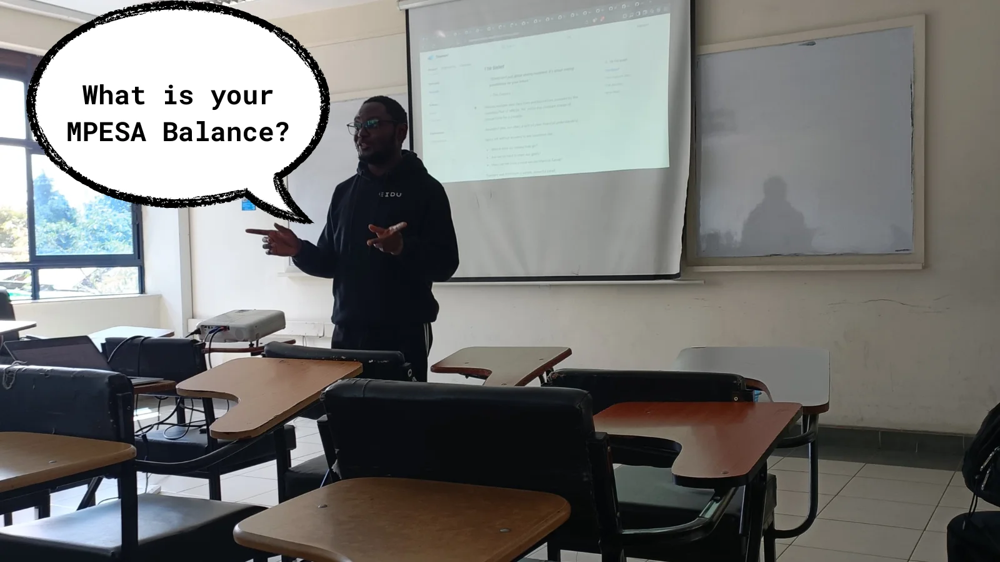
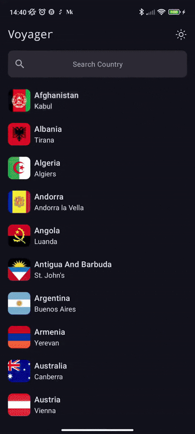

## Know Your Meme 🤣

## Welcomes & Hellos! 🫂

As we slowly ease into the Winter season, we know that for most of you, finding a reliable source of heat is crucial. We also know that some of you missed that amazing event and that is why you are reading this, whether it is from the comfort of your German Machine 🚗, duvet, or otherwise...

This is Episode #27 of The Kotlin Kenya Newsletter...

## Thamani

With the advent of The End Month, we know that you are getting ready to chop that money 💰. Working Class, hello 👋🏽. Anyway, this month's meetup had [The Chief Senior Dishwasher, GDE](https://x.com/mambo_bryan) showcase Thamani. For those of us who are yet to acquire our German Machines 🚙, we understand that showing our MPESA Balance while payong for our Bus Fare can be a little bit difficult. Before you cringe with disgust, allow us to present to you the solution to that very problem. Thamani is an app product that not only displays your MPESA Message in probably the most dynamic ways imaginable, but it also blurs your MPESA Balance. If you are not celebrating by now, then please keep scrolling. For the rest of us, check out Thamani [here](https://thamani.mintlify.app/product/introduction)...

## The Google I/O Recap [2025 Edition] 🤖

### What is New in Jetpack Compose?

Do you like Text? Yes, you heard me right. Do you like Text. Whether you do or not, you will probably be glad to know what is new in Jetpack Compose this year since it was mostly about Text. From the `TextField` to `Modifier`, Android Engineers will surely have an easier time making their products more user-friendly 🫂. How do we know this 😮? Thanks to [Samuel Muigai](https://x.com/SamuelKangau), our community members had more reasons to embrace Jetpack Compose. If you have not then, this is your sign 🫵🏽...

## The Community Showcase 🙌

Do you want to see what our talented community members have been up to? Here you go: 👇

### Voyager [Not The KMP Library]

"Remember Voyager? I've been working on enhancing it with new features to provide even more comprehensive information about each nation."
                    ~ [The Droidette](https://x.com/Jacqui_Gitau)

"In today’s increasingly connected world, understanding different cultures and countries has never been more important. This realisation, coupled with my desire to enhance my Android development skills, led me to create Voyager — an application designed to be a window to the world’s diverse nations and cultures."
                    ~ [The Droidette](https://x.com/Jacqui_Gitau)

If you thought that our veterans have lost their spark, then as usual, I am glad to prove you wrong 😌. Why is that? Well, with the advent of Kotlin Multiplatform [The Droidette](https://x.com/Jacqui_Gitau) decided to revamp one of her products and revamp, she did 🤯. If you are persistent enough to still doubt me, then first off I admire your determination. You would make a great Android Engineer 😉. Anyway, here is a sneek peak to what Voyager has to offer:

Since she anticipated how much you would love it by now, here is an article for the nerds in the room who want to understand what magic she used to build it, and also the link to the product itself if you want to know what tomorrow's weather will be:

The Article: [https://medium.com/@gitaujaquiline/voyager-my-journey-building-an-android-app-to-explore-the-world-part-1-9cfd087c6b18](https://medium.com/@gitaujaquiline/voyager-my-journey-building-an-android-app-to-explore-the-world-part-1-9cfd087c6b18)

The Google Play Store App Link: [https://play.google.com/store/apps/details?id=com.jacqui.voyager](https://play.google.com/store/apps/details?id=com.jacqui.voyager)

## Before You Go 🏃‍♂️

Hey pssst. 😬 Are you interested in giving a presentation in our upcoming meetups? Do you have what it takes to blow the minds of our esteemed community members? 🤯 Or, do you have that project that you cannot wait to show off to our attendees? Well then, what are you waiting for? 😳 [Click me](https://forms.gle/mxUSSg25M6Sb68Ks6) and submit your presentation, will ya?

## Until June 🫂

As this meetup comes to a close, we are excited to plan for the next one. 😃 As our community members, we want you to gain the most value from your membership. What better way to do that than getting involved? How can you do that? 🤓 Well, submitting your presentations, telling a friend to tell a friend, and even attending the meetups are more than enough to start you off. We look forward to seeing you in June. Until then, keep coding and do not forget to touch grasss or something... 😉

## Credits 🎬

### 1. Newsletter Writing, Editing, and Publishing
- [Emmanuel Muturia™](https://x.com/emmanuelmuturia)

### 2. Speakers
- [Michael Ndiritu](https://x.com/ndiritu_michael)
- [Samuel Muigai](https://x.com/SamuelKangau)

### 3. The Organising Team
- [Emmanuel Muturia™](https://x.com/emmanuelmuturia)
- [Michelle Wainaina](https://x.com/mishwainaina)
- [Jeremiah Gitau](https://x.com/_JeremyGitau)
- [Theophilus Kibet](https://x.com/_kibetheophilus)
- [Victor Kirui](https://x.com/Victorvics42)

### 4. Meetup Host
- [Daystar University](https://x.com/DaystarUni)

### 5. Sponsors and Partners
- [Snapp Mobile](https://www.snappmobile.io/)

### 6. Featured
- [The Droidette](https://x.com/Jacqui_Gitau)

### 7. Our Community Members
- [Our Community Members [Android254]](https://www.meetup.com/android254/)
- [Our Community Members [Kotlin Kenya]](https://www.meetup.com/kotlinkenya/)