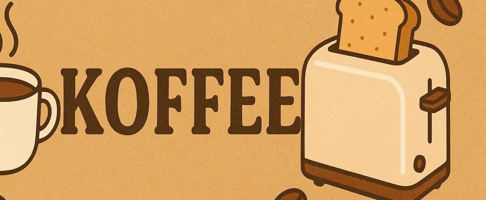

## Know Your Meme 🤣

## Welcomes & Hellos! 🫂

Winter ❄️ has fallen. Get it? Winterfell? Anyway, we hope that you are all well and building as usual. If you did not join us last month in August, then you missed out on a lot. Worry not, for reading this will help you stay in the loop on what we have been up to lately. Whether you are reading this from the comfort of your German Machine 🚗, duvet 🛏️, or otherwise:

This is Episode #30 of The Kotlin Kenya Newsletter...

## Breaking the Walled Garden: Getting Into The iOS Ecosystem in Kenya 🍎

As if sent to break 🔨 the monotony, [John Gachuhi](https://www.linkedin.com/in/garbujohn/) kickstarted his session by introducing the audience to the iOS landscape in Kenya 🇰🇪. He captivated them by further exploring some incredible insights 💬 on navigating Apple's ecosystem from an African developer's perspective...

## From Chaos to Clarity: A Practical Architecture for Compose Apps 🏗️

With all the hype 🗣️ that is constantly being, well, hyped, it is easy to get carried away and forget that Compose exists and that sometimes, building from scratch is the way. Anyway, before you click off and check out your next Coding Assistant 🤖 or whatever trend has been put up, [Joel Kanyi](https://x.com/_joelkanyi) took the attendees through what it takes to build a well-architected Compose application. As a bonus 🎁, he also educated them on what not to do by revealing a messy Compose Codebase that he may or may not have written...

## Shipping Feedback Loop: Accelerating User-Centric Delivery

What better way to close a remarkable meetup by hearing from [The Chief Senior Dishwasher, GDE](https://x.com/mambo_bryan)? While the technical aspects of the previous sessions were critical in sharpening the community members' skills 🧠, he resourcefully shared some good advice about Shipping. Well, not the Amazon 📦 kind but rather, the one where you publish your Android App to Google Play Store and consent to being tortured for weeks on end until they decide to pardon you and have your Android App published but then swiftly remove it and ban you due to who knows what and then ghost you for eternity and therefore waste your time and let me calm down now 😤. Anyway, he essentially asked the room to focus more on building Products than GitHub Projects...

## The Community Showcase 🙌

Do you want to see what our talented community members have been up to? Here you go: 👇

### Koffee

Koffee is a "lightweight, animated toast system for Jetpack Compose. Serve your toasts hot, cold, or custom brewed". Here are some of its "toasty" features:

- 🍞 Simple toast host & state management
- 🪄 Animated entrance/exit with layout awareness
- 🧊 Supports multiple types of toasts: Info, Success, Error, etc.
- 🧩 Plug-and-play composables for custom toast UIs
- 🔧 Customizable positioning, dismissal, durations
- 🪶 Lightweight with zero dependencies

For more information, please check out [this article](https://dev.to/donaldokara/koffee-beautiful-transient-toasts-for-jetpack-compose-297i)...

## Before You Go 🏃‍♂️

Hey pssst 😬. Are you interested in giving a presentation in our upcoming meetups? Do you have what it takes to blow the minds of our esteemed community members 🤯? Or, do you have that project that you cannot wait to show off to our attendees? Well then, what are you waiting for 😳? [Click me](https://forms.gle/mxUSSg25M6Sb68Ks6) and submit your presentation, will ya?

## Until September 🫂

As this meetup comes to a close, we are excited to plan for the next one 😃. As our community members, we want you to gain the most value from your membership. What better way to do that than getting involved? How can you do that 🤓? Well, submitting your presentations, telling a friend to tell a friend, and even attending the meetups are more than enough to start you off. We look forward to seeing you in September. Until then, keep coding and do not forget to touch grasss or something 😉...

## Credits 🎬

### 1. Newsletter Writing, Editing, and Publishing
- [Emmanuel Muturia™](https://x.com/emmanuelmuturia)

### 2. Speakers
- [John Gachuhi](https://www.linkedin.com/in/garbujohn/)
- [Joel Kanyi](https://x.com/_joelkanyi)
- [The Chief Senior Dishwasher, GDE](https://x.com/mambo_bryan)

### 3. The Organising Team
- [Emmanuel Muturia™](https://x.com/emmanuelmuturia)
- [Michelle Wainaina](https://x.com/mishwainaina)
- [Jeremiah Gitau](https://x.com/_JeremyGitau)
- [Theophilus Kibet](https://x.com/_kibetheophilus)
- [Victor Kirui](https://x.com/Victorvics42)

### 4. Meetup Host
- [Paystack](https://x.com/paystack)

### 5. Sponsors & Partners
- [Paystack](https://x.com/paystack)

### 6. Featured
- [Koffee](https://github.com/donald-okara/koffee?tab=readme-ov-file)

### 7. The Community Members
- [The Community Members [Android254]](https://www.meetup.com/android254/)
- [The Community Members [Kotlin Kenya]](https://www.meetup.com/kotlinkenya/)